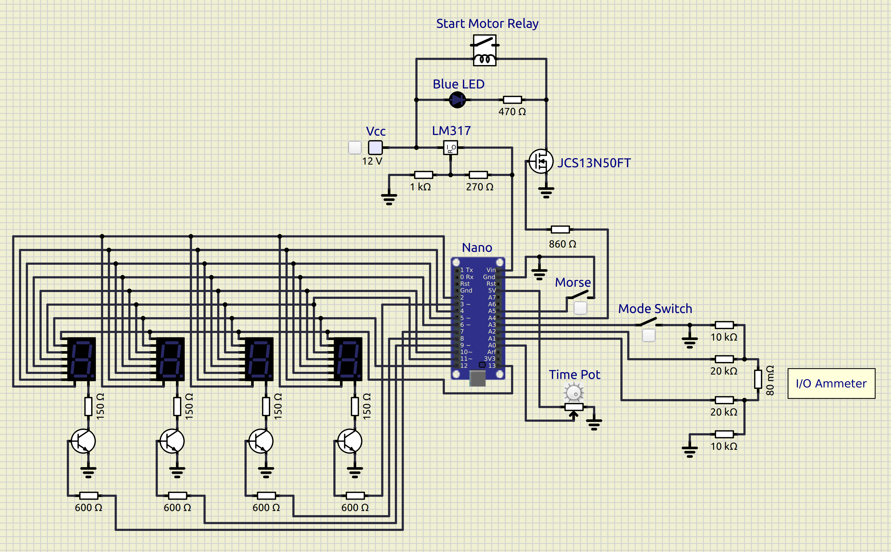
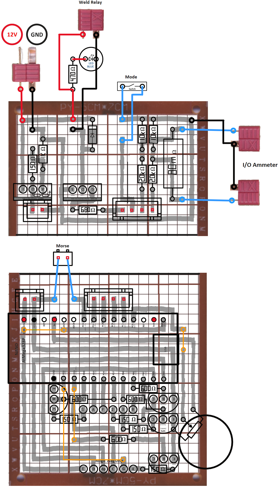
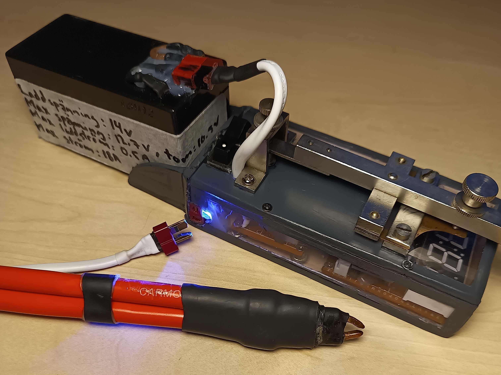
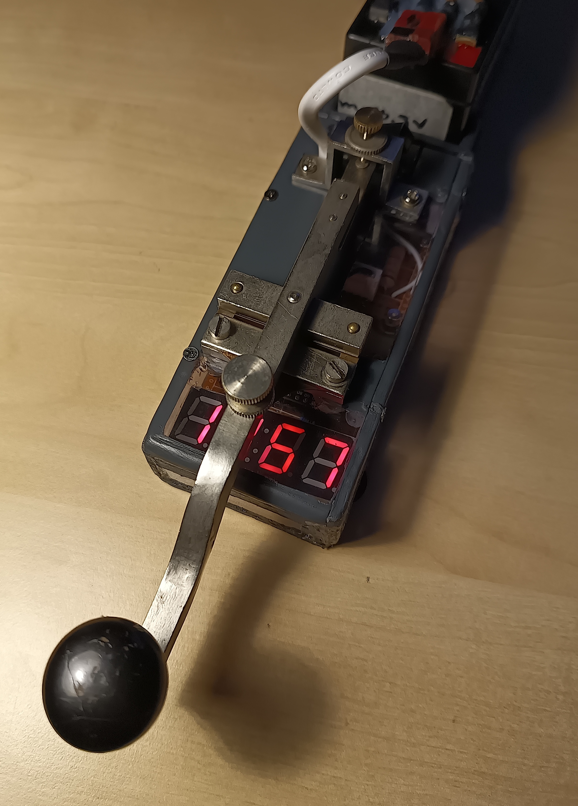
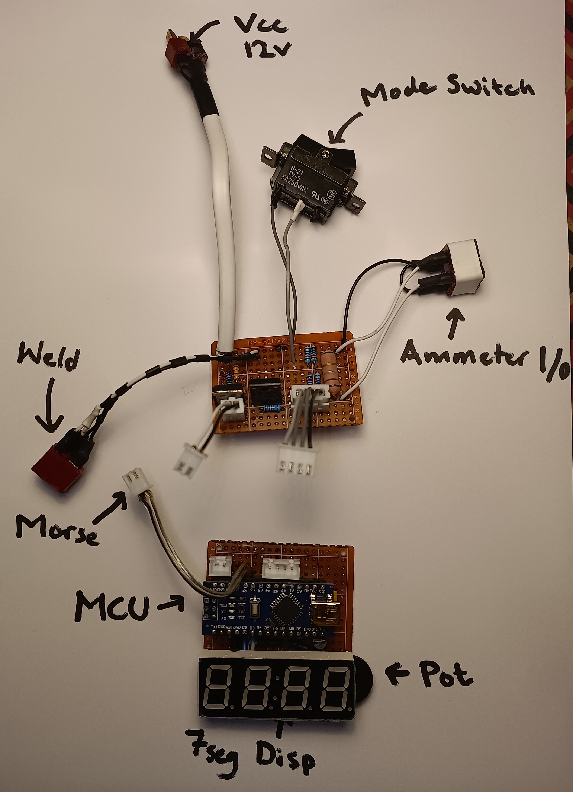
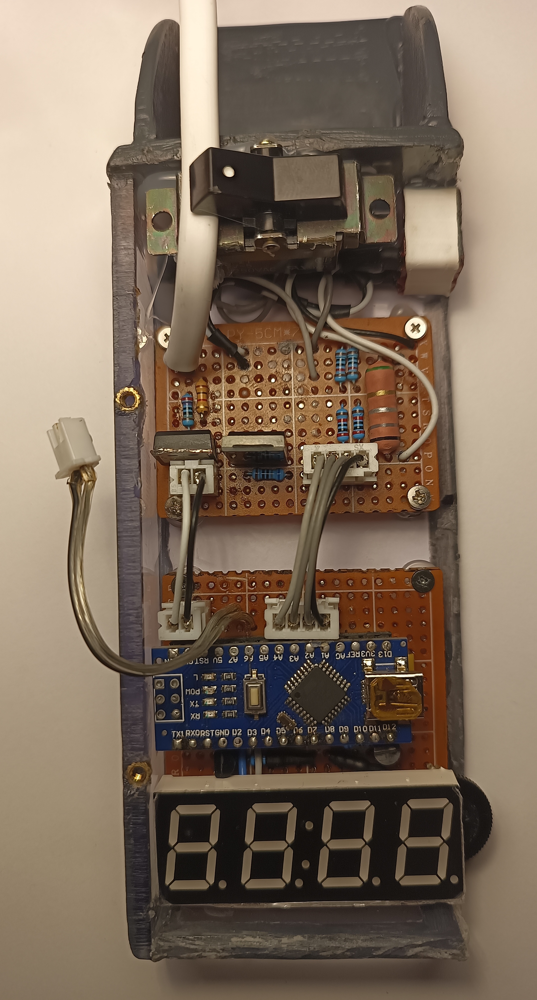

## Overview
SpotWeld is a spot welder project based on the AtMega328p MCU (Nano). It allows for the control of a car battery-powered spot welder for welding nickel strips to battery connectors. Additionally, it includes a separate shunt resistor-based ammeter function that utilizes the unused pins of the microcontroller.

 
## Spot Welder

### Fetures
- Set the welding duration in milliseconds using a potentiometer
- Start the welding process by closing a classical Morse switch
- LED Lights up during the welding process for visual feedback
- The circuit is powered by an L317 linear voltage regulator, with a maximum input voltage of 40V

### How It Works
1. Set the desired welding time with the potentiometer
2. Close the Morse switch to initiate welding
3. The MOSFET activates the automotive relay, closing a circuit with the car battery
4. High current flows through the welding electrodes, heating the nickel strip to weld it to the battery connector

## Ammeter
1. Connect the shunt resistor in series with the load
2. The microcontroller reads the voltage across the shunt resistor to calculate the current flowing through the circuit

## Circuit Diagram

## Photos

    
    

  
  
  

